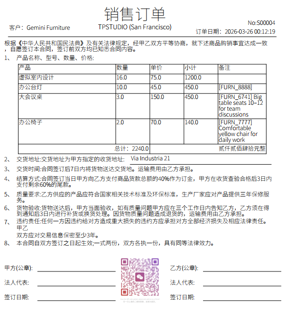
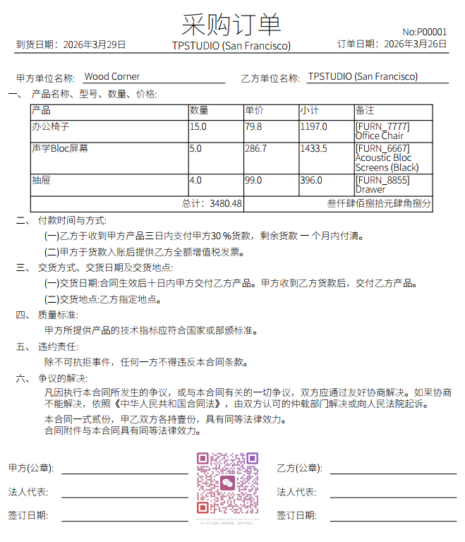

# TPStudio Report System

## 📖 简介

TPStudio Report System 是一个强大的 Odoo 报表生成系统，基于ReportBro库开发，支持导出格式（PDF、Excel），提供可视化配置界面和灵活的自定义函数功能。

### ✨ 主要特性

- ✅ **多格式支持** - PDF、Excel (XLSX)
- ✅ **可视化配置** - 通过 Web 界面配置报表字段和布局
- ✅ **模板管理** - 支持报表配置的导入

---

## 🚀 快速开始

### 安装要求

- Odoo 18.0 Odoo 19.0
- Python 3.10+
- ReportBro 库（用于 PDF 生成）

## 效果：

